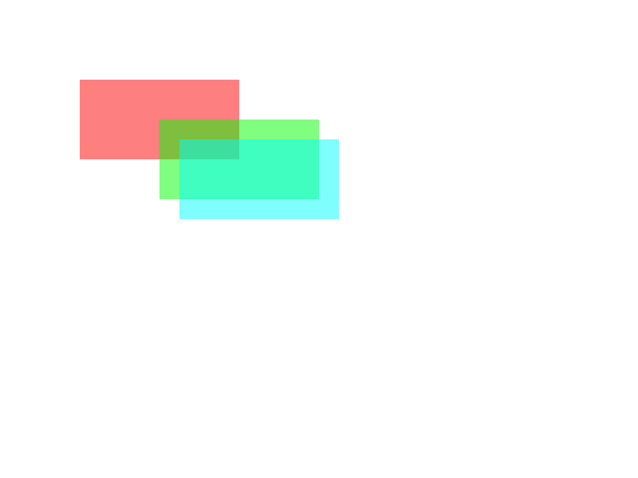

# Kanvas

A lightweight 2D raster graphics and canvas library written in C.

> [!WARNING]
> Kanvas is under active development. The API is unstable and may change without notice.

## Features

- Image-backed canvases
- Drawable primitives
- Alpha compositing
- PNG and PPM import/export
- Retained-mode rendering

## Example

```c
#include <kvs/kvs.h>

int main(void)
{
    kvs_canvas *canvas = kvs_canvas_create(KVS_SIZE(800, 600));

    kvs_drawable *rect = kvs_drawable_rect(KVS_SIZE(200, 100));

    kvs_drawable_set_color(rect, kvs_color_from_hex_rgba(0xFF000080));
    kvs_canvas_add(canvas, rect, KVS_POS(100, 100));

    kvs_drawable_set_color(rect, kvs_color_from_hex_rgba(0x00FF0080));
    kvs_canvas_add(canvas, rect, KVS_POS(200, 150));

    kvs_drawable_set_color(rect, kvs_color_from_hex_rgba(0x00FFFF80));
    kvs_canvas_add(canvas, rect, KVS_POS(225, 175));

    kvs_canvas_render(canvas);

    kvs_image *out = kvs_canvas_export_to_image(canvas);
    kvs_image_write_png(out, "output.png");
    kvs_image_destroy(out);

    kvs_canvas_destroy(canvas);

    kvs_drawable_destroy(rect);

    return 0;
}
```

This should result in the following image:


See [examples/](examples/) for more.

## Dependencies

- `libpng` (optional, disable with `KVS_ENABLE_PNG=OFF`)

## Build

```sh
make
```

Or manually with CMake:

```sh
cmake -B build -S .
cmake --build build
```

## Status

Early development. The API is unstable and tests are still being written.

## Roadmap

- [x] ~~Image drawables~~
    - [ ] (optional) Use `state.color` as tint

- [x] ~~Basic color parsing~~
    - [x] ~~RGBA~~
    - [x] ~~RGB~~
    - [x] ~~Hexadecimal~~

- [x] ~~Drawable bounding boxes~~

- [ ] Rasterize per drawable instead of per pixel

- [ ] Moving from LinkedList to Array for Canvas Nodes

- [ ] Error handling
    - [ ] Error messages
    - [ ] Error types
    - [ ] Error handling helper macros and functions
    - [ ] (optional) `errno` integration

- [ ] Add tests
    - [ ] Basic tests
    - [ ] Mandatory tests
    - [ ] Stability tests
    - [ ] ABI tests
    - [ ] Additional tests

- [ ] Add color constants
    - [ ] Basic common color constants
    - [ ] (optional) Additional color constants

- [ ] Improve documentation and examples

- [ ] Blending mode support
    - [ ] Normal blending
    - [ ] Additive blending
    - [ ] Multiply blending
    - [ ] Configurable blending

- [ ] Clipping/scissor regions

- [ ] Image format support
    - [x] ~~PNG~~
        - [ ] Add more detailed PNG metadata
    - [ ] JPEG
    - [ ] (optional) BMP

- [ ] Introduce format-aware color representation
    - [ ] Generic pixel format abstraction
    - [ ] RGBA8888 support
    - [ ] RGB888 support

- [ ] Add pixel storage format support
    - [ ] BGRA8888
    - [ ] RGB565
    - [ ] GRAY8
    - [ ] Configurable pixel storage format

- [ ] Add color space support
    - [x] ~~sRGB~~
    - [ ] (optional) Linear RGB
    - [ ] Configurable color space

- [ ] Add color model support
    - [x] ~~RGB~~
    - [ ] HSL
    - [ ] HSV
    - [ ] (optional) Grayscale
    - [ ] (optional) CMYK
    - [ ] Configurable color model

- [ ] Drawable scaling
    - [ ] Nearest scaling
    - [ ] Bilinear scaling
    - [ ] (optional) Bicubic scaling
    - [ ] Configurable scaling

- [ ] Text drawables
    - [ ] `FreeType` integration
    - [ ] `HarfBuzz` shaping

- [ ] **Stabilization**
    - [ ] Stabilize the naming convention
    - [ ] Stabilize the standards
    - [ ] Stabilize the codebase
    - [ ] Stabilize the ABI
    - [ ] (optional) Stabilize the Build System

- [ ] Boolean drawable operations
    - [ ] Union operations
    - [ ] Subtract operations
    - [ ] Intersection operations
    - [ ] Masking operations

- [ ] Optimizations
    - [ ] Basic optimizations
    - [ ] Developer experience optimizations
    - [ ] Performance optimizations
    - [ ] (optional) Profiling

## License

Licensed under the Apache License 2.0.  
See [LICENSE](LICENSE).