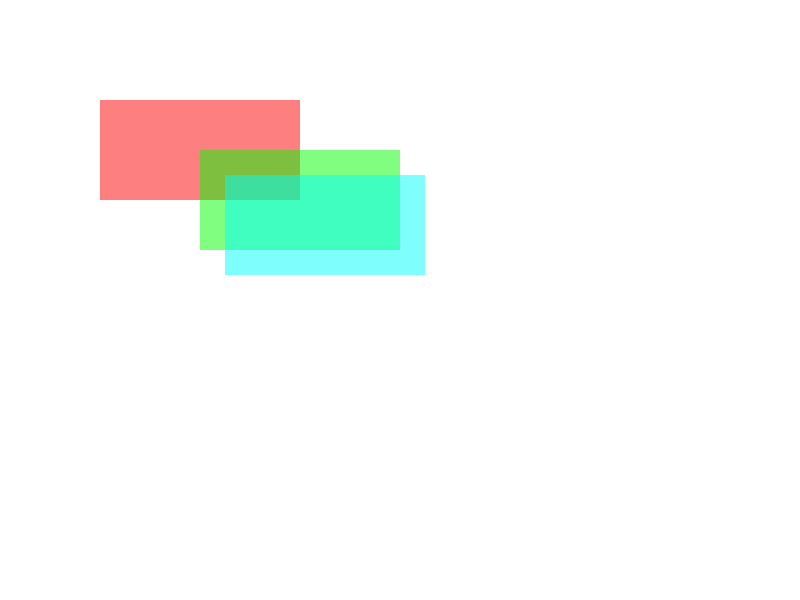

# Kanvas

A lightweight 2D raster graphics and canvas library written in C.

> [!WARNING]
> Kanvas is under active development. The API is unstable and may change without notice.

## Features

- Image-backed canvases
- Drawable primitives
- Alpha compositing
- PNG and PPM import/export
- Retained-mode rendering

## Example

```c
#include <kvs/kvs.h>

int main(void)
{
    kvs_canvas *canvas = kvs_canvas_create(KVS_SIZE(800, 600));

    kvs_drawable *rect = kvs_drawable_rect(KVS_SIZE(200, 100));

    kvs_drawable_set_color(rect, kvs_color_from_rgba(255, 0, 0, 128));
    kvs_canvas_add(canvas, rect, KVS_POS(100, 100));

    kvs_drawable_set_color(rect, kvs_color_from_rgba(0, 255, 0, 128));
    kvs_canvas_add(canvas, rect, KVS_POS(200, 150));

    kvs_drawable_set_color(rect, kvs_color_from_rgba(0, 255, 255, 128));
    kvs_canvas_add(canvas, rect, KVS_POS(200, 150));

    kvs_canvas_render(canvas);

    kvs_image *out = kvs_canvas_export_to_image(canvas);
    kvs_image_write_png(out, "output.png");
    kvs_image_destroy(out);

    kvs_canvas_destroy(canvas);

    kvs_drawable_destroy(rect);

    return 0;
}
```

This should result in the following image:


See [examples/](examples/) for more.

## Dependencies

- `libpng` (optional, disable with `KVS_ENABLE_PNG=OFF`)

## Build

```sh
make
```

Or manually with CMake:

```sh
cmake -B build -S .
cmake --build build
```

## Status

Early development. The API is unstable and tests are still being written.

## Roadmap

- [x] ~~Image drawables~~
    - [ ] Use `state.color` as tint
- [ ] Drawable bounding boxes
- [ ] Rasterize per drawable instead of per pixel
- [ ] Proper (and more) examples
- [ ] Error handling
- [ ] Add tests
- [ ] Drawable scaling
- [ ] Vector operations
- [ ] Text rendering (FreeType + HarfBuzz)

## License

Licensed under the Apache License 2.0.  
See [LICENSE](LICENSE).